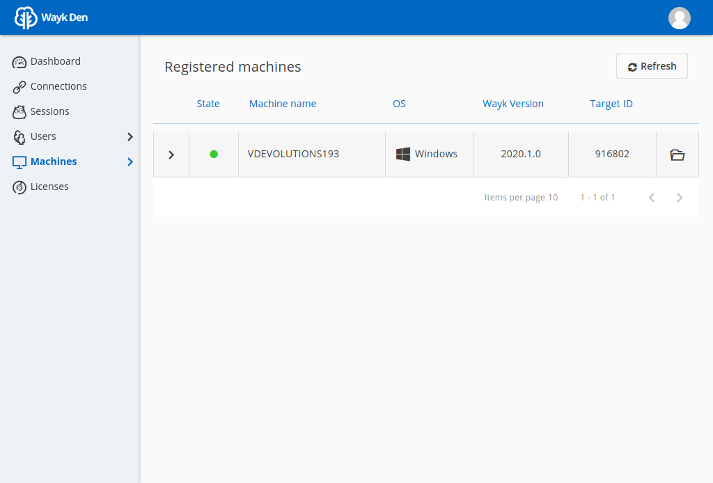
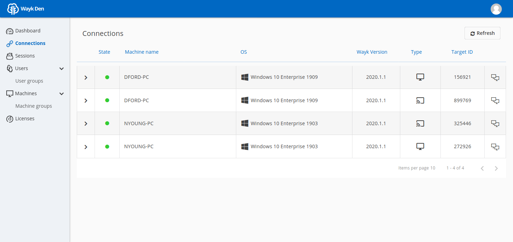
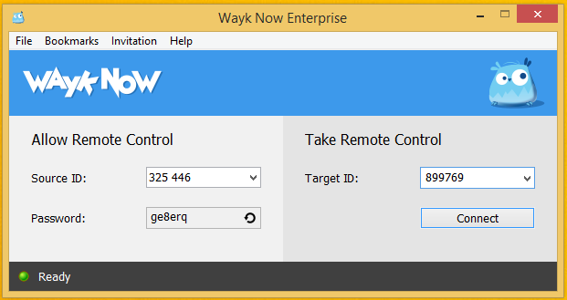
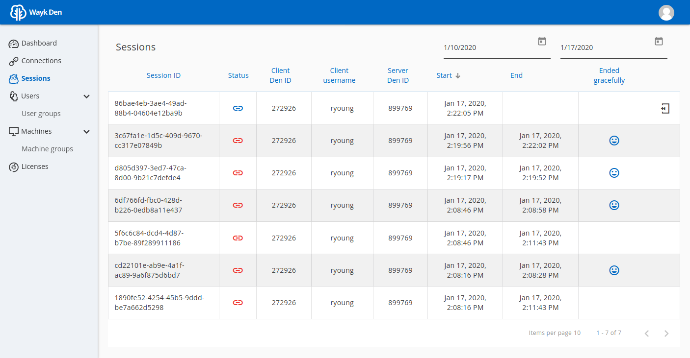

= Getting Started

== Overview

This getting started guide provides instructions for setting up a one-time Wayk Den demo environment using a https://blog.cloudflare.com/a-free-argo-tunnel-for-your-next-project/[free Cloudflare Argo tunnel] for external access.

 . Launch Wayk Den for localhost access only
 . Create free Argo tunnel for external access
 . Launch Wayk Den using the Argo tunnel external URL
 . Complete initial configuration from Wayk Den Web UI
 . Configure a Windows machine for unattended access
 . Connect to the Windows machine using a Wayk Now client

== Instructions

=== Step 1: Launch Wayk Den for localhost access only

Open a PowerShell terminal and load the `WaykDen` module. Create a new directory for your Wayk Den configuration files and move into it. Create a new configuration using your external URL and "windjammer.local" as the realm, then start Wayk Den:

----
$ Import-Module WaykDen
$ mkdir ~/den-test
$ cd ~/den-test
$ New-WaykDenConfig -Realm windjammer.local -ExternalUrl http://localhost:4000
$ Start-WaykDen
----

The realm is a domain name for your Wayk Den, very similar to a Windows Active Directory domain name, but it does not need to be a valid DNS domain name. In this case, we use `windjammer.local` for a fictional company called "Windjammer".

Do not open http://localhost:4000 in a browser yet, we will access it through the Argo tunnel instead. We just need Wayk Den to be running first for the Argo tunnel to be opened.

Leave this terminal open, we will come back to it later.

=== Step 2: Create free Argo tunnel for external access

https://developers.cloudflare.com/argo-tunnel/downloads/[Download] the `cloudflared` executable for your platform to a known path

Open a new terminal and move to the directory where the `cloudflared` executable is located, then confirm that the tool can be found at command-line:

----
$ cloudflared --version
cloudflared version 2019.12.0 (built 2019-12-19-2246 UTC)
----

Create a free Argo tunnel pointing to "http://localhost:4000" and wait for it to become ready:

----
$ cloudflared tunnel --url http://localhost:4000
----

Search within the terminal output for your trycloudflare.com generated URL, it should look like this:

----
INFO[0002] +--------------------------------------------------------+  connectionID=0
INFO[0002] |  Your free tunnel has started! Visit it:               |  connectionID=0
INFO[0002] |    https://wayk-den-demo-test.trycloudflare.com        |  connectionID=0
INFO[0002] +--------------------------------------------------------+  connectionID=0
----

This terminal needs to remain open to keep the Argo tunnel active.

The free tunnel URL changes every time and is composed of 4 random words, but this is fine as we are using this for a one-time Wayk Den demo environment. You will get a different URL every time you create a free Argo tunnel, unless you register for the https://developers.cloudflare.com/argo-tunnel/quickstart/[paid service].

For the purpose of this guide, the external URL is "https://wayk-den-demo-test.trycloudflare.com", but you will need to replace it with the one you obtained when following these instructions.

=== Step 3: Launch Wayk Den using the Argo tunnel external URL

Now that we have launched the Argo tunnel, HTTP requests to "https://wayk-den-demo-test.trycloudflare.com" will be automatically redirected to "http://localhost:4000", with SSL/TLS certificates automatically handled by Cloudflare.

Go back to the PowerShell terminal where Wayk Den was started. Stop Wayk Den, modify the external URL and start Wayk Den again.

----
$ Stop-WaykDen
$ Set-WaykDenConfig -ExternalUrl https://wayk-den-demo-test.trycloudflare.com
$ Start-WaykDen
----

That's it! You should now be able to open the external URL in a browser and see a login page.

=== Step 4: Complete initial configuration from Wayk Den Web UI

Now that Wayk Den is running and available externally through an Argo tunnel, you can proceed to creating a first admin user.

Open your external URL ("https://wayk-den-demo-test.trycloudflare.com") in a browser. In a fresh installation, you can login using the "wayk-admin" username and "wayk-admin" password, after which you will be asked to create your first admin user.

image::images/den_initial_login.png[Wayk Den initial login]

For the purpose of this guide, we will create the user "admin" with the password "admin123!". All passwords for test purposes will be the same as the username with "123!" appended to it.

image::images/den_initial_admin.png[Wayk Den initial admin]

If you do not have a fresh database and wish to reset it, you can stop the Wayk Den and run "docker rm den-mongo" and "den volume rm den-mongodata" and start the Wayk Den. We will improve database management soon.

Once logged in, you can click on Users from the left navigation menu:

image::images/den_user_list_admin.png[Wayk Den user list]

In the top right corner, Click "Add" to create a new user called "David Ford" with username "dford" and password "dford123!":

image::images/den_add_user_dford.png[Wayk Den add user dford]

In the top right corner, Click "Add" to create a new user called "Robert Young" with username "ryoung" and password "ryoung123!":

image::images/den_add_user_ryoung.png[Wayk Den add user ryoung]

You should list of users should now look like this:

image::images/den_user_list_test.png[Wayk Den user list]

You are now ready to try connecting Wayk Now to your Wayk Den with your test users.

=== Step 5: Configure a Windows machine for unattended access

For the purpose of this guide, this machine will be called "DFORD-PC".

On a Windows machine, install https://wayk.devolutions.net/home/download[Wayk Now] using the .msi installer. You can use the https://helpwayk.devolutions.net/[Wayk Now online help] as reference.

Once installed, launch Wayk Now, then click File -> Options from the menu of the main window.

Click "Unlock" at the bottom left of the Options window to elevate permissions and allow modifications to settings affecting the Wayk Now unattended service.

In the "Connectivity" section, change the "Wayk Den Server Url" value to your Wayk Den external URL (https://wayk-den-demo-test.trycloudflare.com) and click OK to apply the changes.

image::images/now_den_server_url.png[Wayk Now Options - Wayk Den Server URL]

The Wayk Now main window status bar should show a red circle for a few seconds, then it show go back to green when it has connected to the new Wayk Den.

Go back to the "Connectivity" section of the Options window and unlock it again. Under "Wayk Now User", you should now see a "Login" link. 

Click on "Login" to open the Wayk Den login page with the default system browser. Enter "dford" as the username and "dford123!" as the password, then click Continue.

image::images/now_den_login_user_dford.png[Wayk Den User Login]

You should now see a login success page:

image::images/now_den_login_success.png[Wayk Den User Login Success]

Close the browser and come back to the Wayk Now Options window. It should now show the user "dford" as logged in to Wayk Den:

image::images/now_den_server_user_dford_unregistered.png[Wayk Now Options - Wayk Den User]

Last but not least, click "Register" to register the machine for unattended access.

image::images/now_den_server_user_dford_registered.png[Wayk Now Options - Wayk Den User]

To verify that the machine was correctly registered, go back to the Wayk Den Web UI and go in the "Machines" section. Your machine should now be listed:

=== Step 6: Connect to the Windows machine using a Wayk Now client

On another machine, install Wayk Now, and the instructions of the previous step for the Wayk Den configuration, with the exception of the unattended machine registration which is not required. When logging in, use "ryoung" as the username and "ryoung123!" as the password.

For the purpose of this guide, this machine will be called "NYOUNG-PC".

At this point, you should be able to see both machines connected to the Wayk Den in the "Connections" section:

Each machine is shown as connected twice, because the unattended service and the Wayk Now client make separate connections to the Wayk Den.

From the connection list, we can see that the target id of "DFORD-PC" is "899769". This target id is also shown in the Wayk Now main window on DFORD-PC in the "Source ID" field.

On NYOUNG-PC, launch Wayk Now, type "899769" in the "Target ID" field and click "Connect":

At the login prompt, select "Secure Remote Delegation (SRD)" and enter a valid system username + password for the target machine ("DFORD-PC").

Once connected, you should now be able to see your active session in the "Sessions" section of the Wayk Den Web UI:

This list contains both current and past sessions for monitoring and auditing purposes.
